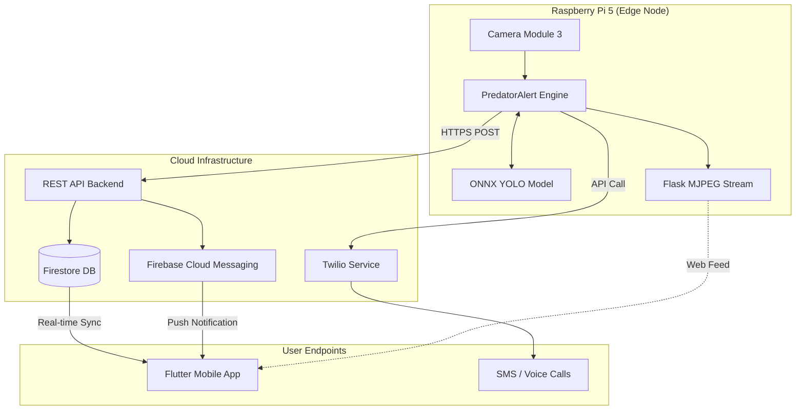
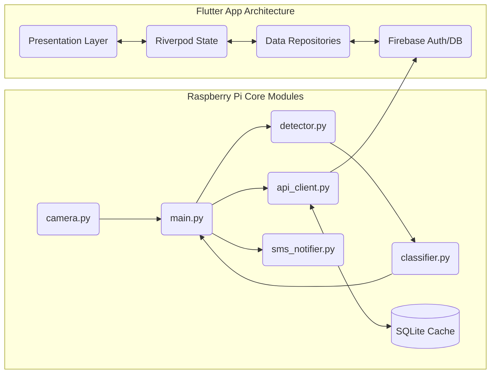
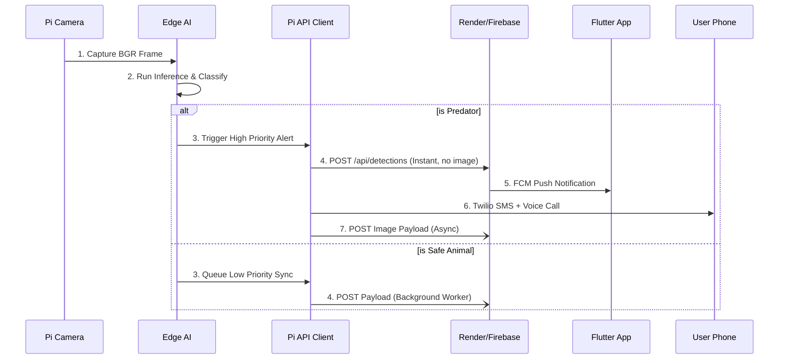
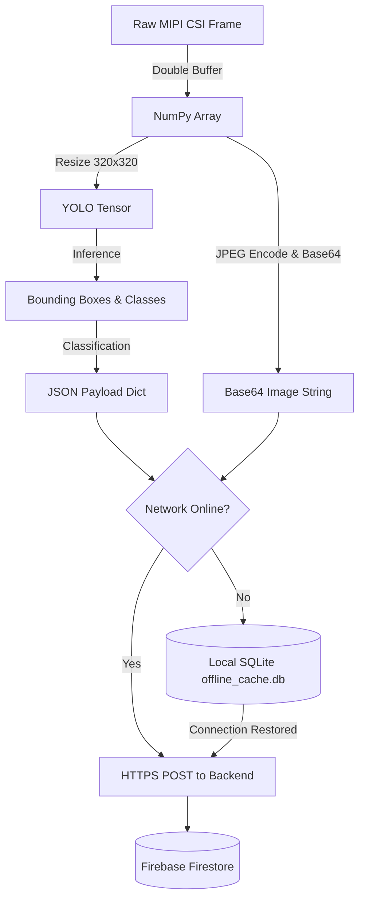
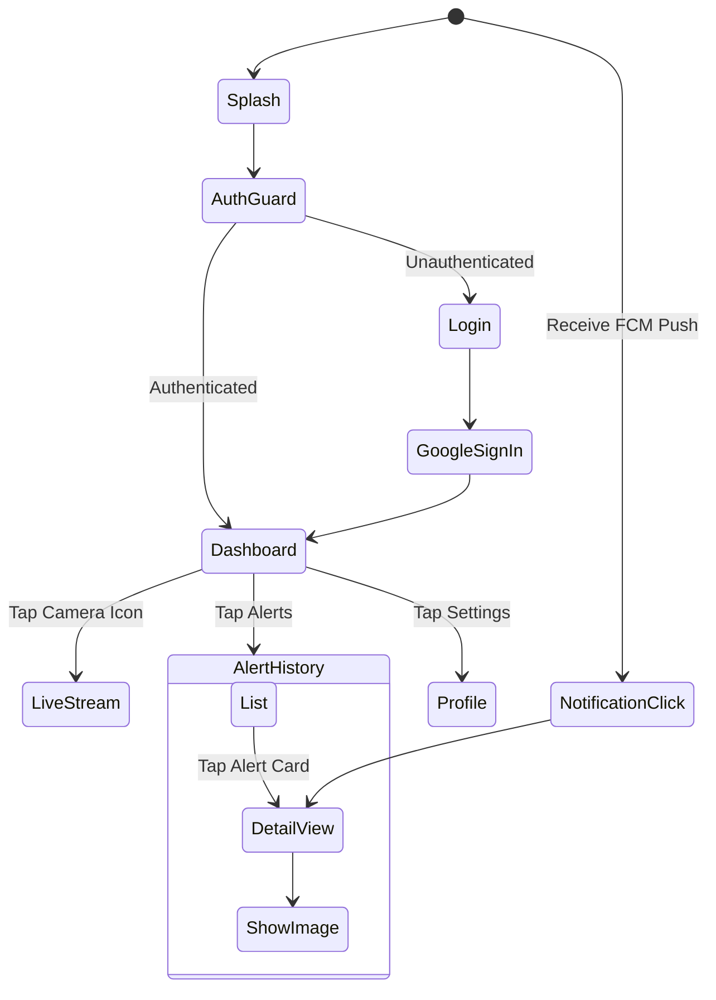
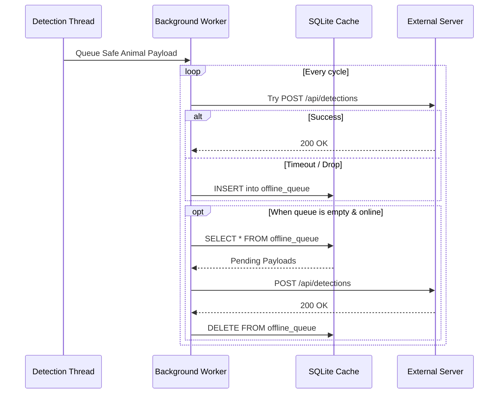
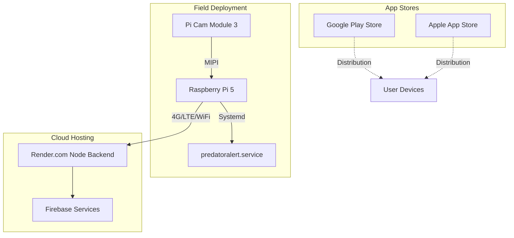

<div align="center">
  
  <h1>🚨 PredatorAlert Edge AI System</h1>
  <p><strong>Real-Time Wildlife Intrusion Detection System & Mobile Alert Platform</strong></p>
  
  [](#)
  [](#)
  [](#)
  [](#)
  [](#)
  [](#)
</div>

---

## 1. 📖 Project Overview
**PredatorAlert** is an end-to-end, real-time wildlife monitoring and early-warning ecosystem. It bridges the gap between **embedded edge computing, artificial intelligence, and mobile cloud integration** to protect rural communities and livestock from dangerous animal intrusions. By running heavily optimized computer vision models directly on edge hardware, the system eliminates cloud-inference latency and ensures instant notifications when human life or property is at risk.

## 2. ⚠️ Problem Statement
Human-wildlife conflict is an escalating global crisis. As human settlements encroach on natural habitats, communities—especially farmers and forest edge inhabitants—face constant threats from predators like tigers, bears, and wolves. 
Traditional monitoring systems rely on motion-sensor traps that:
- Lack real-time alerting capabilities.
- Trigger false positives on benign movement (wind, safe animals).
- Require human review of SD cards.
An intelligent, proactive, and immediate early-warning system is critically needed to save lives.

## 3. 💡 Solution Overview
PredatorAlert solves this by pushing the intelligence to the edge. The system utilizes a custom-trained **YOLO (You Only Look Once)** computer vision model deployed on a Raspberry Pi 5. It continuously processes live video feeds locally, categorizes detected animals into "predator" or "safe" priority tiers, and instantly triggers a dual-path notification system. 

Alerts are delivered via **Twilio SMS/Calls** for immediate off-grid awareness, and simultaneously pushed through a robust backend to the **PredatorAlert Flutter Mobile App**, which provides a live dashboard, analytics, and high-priority push notifications to stakeholders.

## 4. ✨ Key Features
- **Real-Time Edge AI:** ONNX-optimized YOLO model inference running locally at high speed on the Pi 5.
- **Intelligent Threat Prioritization:** Automatically differentiates between safe animals (cows, sheep) and critical predators.
- **Offline Payload Caching:** Edge-resilience via SQLite. Failed alerts during network drops are cached and auto-synced upon reconnection.
- **Dual-Path Instant Alerts:** Fires a lightweight, text-only REST payload milliseconds after detection, following up asynchronously with the heavy image payload.
- **Twilio Voice & SMS Integration:** Automated emergency phone calls using text-to-speech TwiML and SMS messaging with configurable cooldowns.
- **Full-Stack Mobile App:** Cross-platform Flutter application utilizing Riverpod and Firebase for live streaming, push notifications, and analytic charts.
- **Live Video Streaming:** Built-in Flask MJPEG server for remote live-feed verification.
- **Automated Service Management:** Deployed as a robust `systemd` daemon with CPU quotas, memory limits, and auto-restart capabilities.

---

# 🏛️ SYSTEM ARCHITECTURE

The ecosystem is built on a distributed architecture separating the heavy ML workload (Edge) from the user interface (Mobile) via a scalable event-driven Cloud Backend.

### 1. High-Level Architecture Diagram


### 2. System Component Diagram


### 3. End-to-End Workflow Diagram


### 4. Data Flow Diagram


### 5. Detection Pipeline Flowchart
```mermaid
flowchart TD
    Start([main.py Loop]) --> Cap[camera.capture_frame()]
    Cap --> Det[detector.detect()]
    Det --> Valid{Conf > 0.65?}
    Valid -- No --> Next([Wait 2s])
    Valid -- Yes --> Class[classifier.classify_batch()]
    Class --> Map[Map against PREDATOR_ANIMALS]
    Map --> Risk{Is Predator?}
    Risk -- Yes --> Red[Draw Red Box]
    Risk -- No --> Green[Draw Green Box]
    Red --> Fire[Spawn Instant Alert Thread]
    Green --> Q[Enqueue to Background Worker]
    Fire --> Next
    Q --> Next
```

### 6. Mobile App Interaction Diagram


### 7. API Communication Diagram (Edge Reliability)


### 8. Deployment Architecture Diagram


---

# 📖 DETAILED TECHNICAL DOCUMENTATION

## 💻 Technology Stack

### Hardware & Embedded Layer
| Component | Specification |
|-----------|---------------|
| **Core Compute** | Raspberry Pi 5 (8GB RAM) |
| **Camera** | Raspberry Pi Camera Module 3 (Sony IMX708, PDAF) |
| **OS** | Raspberry Pi OS (64-bit Debian) |
| **Libraries** | Python 3.12, OpenCV, Picamera2 |

### AI / ML Stack
| Component | Description |
|-----------|-------------|
| **Model** | YOLOv8 / YOLOv10 (Custom Trained) |
| **Export Format** | ONNX (Open Neural Network Exchange) |
| **Engine** | Ultralytics, ONNXRuntime |
| **Classes** | Tiger, Elephant, Bear, Fox, Boar (Predators), Cows, Sheep (Safe) |

### Mobile App (Flutter)
| Component | Description |
|-----------|-------------|
| **Framework** | Flutter (Dart) |
| **State Management** | Riverpod |
| **Backend/Auth** | Firebase Auth, Google Sign-In |
| **Database** | Cloud Firestore |
| **Notifications** | Firebase Cloud Messaging (FCM) + `flutter_local_notifications` |
| **UI/UX** | `shimmer`, `cached_network_image`, `fl_chart` (Analytics) |

---

## 🛠️ Raspberry Pi Module Explanation

The edge code resides in the root directory and is highly modularized:
- **`main.py`**: The application controller. Initializes all modules, runs the main 2-second detection loop, and starts the Flask background thread for the `http://<PI_IP>:5000/video_feed` MJPEG stream.
- **`camera.py`**: A robust wrapper that utilizes a **double-buffering** technique. A background daemon thread constantly fetches frames to a lock-protected variable, ensuring the main AI loop never blocks waiting for the camera I/O.
- **`classifier.py`**: Maps raw YOLO strings (e.g., `asian_elephant`) to normalized internal logic (`elephant`) and cross-references against `PREDATOR_ANIMALS` to assign a threat priority level (1 to 4).
- **`api_client.py`**: The core networking module. Implements **Instant Threading** for predators (sending alerts immediately before encoding images) and a persistent **SQLite Database** for offline caching.
- **`logger.py`**: Dual-output structured logging. Writes JSON-like formatted logs to `/home/pi/logs/` and stdout for `journald` compatibility.

## 🧠 AI/ML Documentation

The system relies on a custom YOLO model tailored for edge hardware:
- **ONNX Optimization**: The standard PyTorch `.pt` file is exported to `.onnx`. On ARM64 processors (like the Pi 5), `onnxruntime` heavily outperforms PyTorch natively, boosting FPS significantly.
- **Inference Size**: Scaled down to `320x320` input size via `Config.INFERENCE_IMGSZ`. This reduces mathematical operations by 4x compared to `640x640`, making it perfect for 2-second interval thermal stability.
- **Warmup Phase**: The `detector.initialize()` method runs a dummy black tensor through the model at startup to pre-compile the computational graph, preventing lag on the first real detection.

## 📱 Flutter App Documentation

Located in `flutter_app/`, built using **Clean Architecture** principles:
- **`lib/core/`**: Houses routing, constants, and theme data (Dark mode implementation).
- **`lib/data/`**: Repositories handling Firestore API calls and Authentication logic.
- **`lib/presentation/`**: UI logic managed by Riverpod providers.
  - **Dashboard**: Features an `fl_chart` graph showing detection trends over the week.
  - **Alert Feed**: Real-time paginated list of incoming threats listening to Firestore snapshots.
  - **Live Stream View**: An embedded web view connecting to the Pi's MJPEG endpoint.
- **Audio/Vibration**: Critical alerts trigger bypass-silent-mode vibrations and klaxon sounds via the `audioplayers` package.

---

# 🚀 INSTALLATION & SETUP GUIDE

## 1. Raspberry Pi Edge Setup

1. **Clone & Environment**:
   ```bash
   git clone https://github.com/JOJI-25/PredatorAlertor.git
   cd PredatorAlertor
   python3 -m venv venv
   source venv/bin/activate
   ```

2. **Install Dependencies**:
   ```bash
   pip install -r requirements.txt
   pip install onnx onnxruntime --break-system-packages
   ```

3. **Environment & Model Configuration**:
   ```bash
   cp .env.example .env
   mkdir models
   ```
   *Edit `.env` to add your Twilio Keys and Backend URL.* Place your `best.onnx` model inside the `models/` directory.

4. **Install as Systemd Service**:
   ```bash
   sudo cp predatoralert.service /etc/systemd/system/
   sudo systemctl daemon-reload
   sudo systemctl enable predatoralert
   sudo systemctl start predatoralert
   ```

## 2. Flutter App Setup

1. **Install Flutter**: Ensure Flutter SDK > 3.16 is installed.
2. **Navigate & Fetch**:
   ```bash
   cd flutter_app
   flutter pub get
   ```
3. **Firebase Configuration**:
   Place your generated `google-services.json` in `flutter_app/android/app/` and `GoogleService-Info.plist` in `flutter_app/ios/Runner/`.
4. **Run Emulator**:
   ```bash
   flutter run
   ```

---

# ⚙️ EXECUTION FLOW DOCUMENTATION

1. **Systemd Boot:** Raspberry Pi powers on; `predatoralert.service` launches `main.py`.
2. **Warmup:** YOLO model loads to RAM; dummy inference warms up the graph. Camera double-buffer thread begins.
3. **Detection Loop (Every 2s):** Main thread copies the latest frame from the buffer and passes it to `detector.py`.
4. **Logic Filter:** Detections > 0.65 confidence are passed to `classifier.py`.
5. **Predator Match:** A tiger is detected. `api_client` instantly spawns a thread sending a text-only HTTP POST, while `sms_notifier` spawns threads for Twilio SMS and Voice Calls.
6. **Image Encoding:** The BGR frame is encoded to JPEG, converted to Base64, and POSTed to the backend.
7. **Cloud Routing:** Render/Node backend receives the payload, saves the Base64 image to Google Cloud Storage/Firestore, and triggers an FCM Push.
8. **Mobile Alert:** The Flutter app receives the FCM payload in the background, triggers a local notification with sound, and updates the Live Dashboard UI via Riverpod stream listening.

---

# 🏎️ PERFORMANCE & OPTIMIZATION

- **Thermal Throttling Prevention:** Inference is capped at 0.5 FPS (every 2 seconds). This ensures the Pi 5's Broadcom CPU never hits 85°C, eliminating the need for active cooling in deep-forest deployments.
- **Memory Footprint:** The Pi service restricts memory to `MemoryMax=2G` via systemd to ensure OS stability.
- **Instant Alerting:** By separating the JSON text payload from the Base64 image payload, the alert network packet is reduced to < 1KB, ensuring sub-second delivery even on poor 2G/3G rural cellular networks.

---

# 🔒 SECURITY DOCUMENTATION

- **Edge Sandbox:** The Pi service runs under a restricted `pi` user with `NoNewPrivileges=true`.
- **API Authentication:** All edge-to-cloud traffic is secured via HTTPS and authenticates using a hardcoded `Bearer <API_KEY>`.
- **Firebase Rules:** Firestore security rules ensure that mobile app users must be authenticated via Google OAuth to view or delete alerts.

---

# 🔮 FUTURE IMPROVEMENTS

- [ ] **Hailo-8 AI Accelerator:** Transition from CPU inference to a PCIe-based Hailo-8 M.2 module to achieve 30+ FPS real-time tracking.
- [ ] **Thermal/IR Integration:** Replace the standard Camera Module 3 with a FLIR thermal camera for pitch-black nocturnal monitoring.
- [ ] **LoRaWAN Mesh:** Replace Wi-Fi/Cellular API calls with LoRaWAN packets for off-grid forest deployments with zero cellular connectivity.
- [ ] **Federated Learning:** Allow the Pi to upload false positives via the app to retrain the central YOLO model autonomously.

---

<div align="center">
  <i>Architected by Joji-25</i><br>
  <i>Protecting wildlife and human life through intelligent edge computing.</i>
</div>
