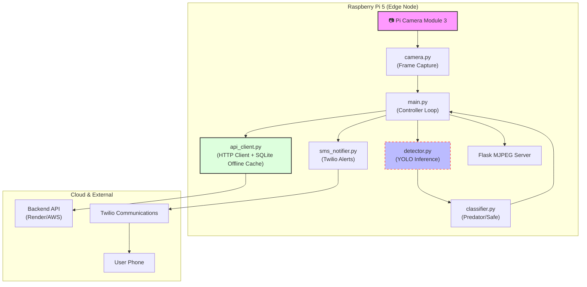
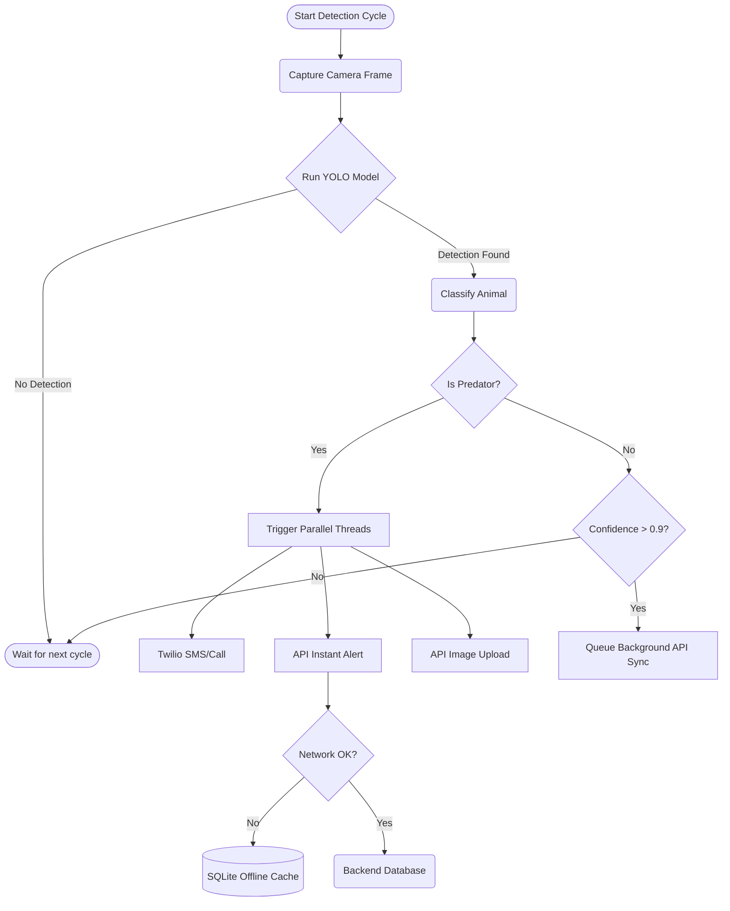

<div align="center">
  
  <h1>🚨 PredatorAlert Edge AI</h1>
  <p><strong>Real-Time Wildlife Intrusion Detection System for Edge Devices</strong></p>
  
  [](#)
  [](#)
  [](#)
  [](#)
  [](#)
  [](#)
</div>

---

## 1. 📖 Problem Statement
Human-wildlife conflict is a growing crisis globally. Farmers, rural communities, and forest edge inhabitants constantly face the threat of predator intrusions (tigers, lions, bears), which result in loss of livestock, property damage, and tragic loss of human life. Traditional methods like electrical fences are expensive, often harmful, and lack real-time monitoring capabilities. A proactive, highly accurate, and immediate early-warning system is critically needed.

## 2. 💡 Solution Overview
**PredatorAlert** is an intelligent, edge-computing wildlife detection system. Designed to run entirely on a low-cost Raspberry Pi 5 without requiring constant cloud inference, the system uses a custom-trained **YOLO (You Only Look Once)** computer vision model to identify and classify animals in real-time. 

When a dangerous predator is detected, the system immediately triggers a dual-path alert: 
1. **Instant Twilio SMS & Phone Call** to stakeholders.
2. **API Payload** with the captured frame to a central backend dashboard.

## 3. ✨ Features
- **Real-Time AI Processing:** Runs edge inference using ONNX-optimized YOLO models directly on the Pi 5.
- **Priority Classification:** Differentiates between benign animals (e.g., cows, sheep) and critical threats.
- **Dual-Path API Architecture:** Sends a lightweight instant alert milliseconds after detection.
- **Offline Payload Caching:** Uses a local SQLite database to cache failed alerts during internet outages.
- **Mobile Companion App:** Includes a fully-featured Flutter mobile application for push notifications and live dashboard monitoring.
- **Live Video Streaming:** Built-in Flask MJPEG server for remote live-feed monitoring.
- **Automated Service Recovery:** Managed via systemd with auto-restart, CPU quota limits, and memory management.
- **Robust Hardware Integration:** Seamlessly works with the Raspberry Pi Camera Module 3 using double-buffering to prevent frame dropping.

---

## 4. 🏛️ System Architecture

PredatorAlert is divided into an Edge Node (the Pi) and the Cloud Backend.



---

## 5. 🔄 Workflow Explanation

The system operates in a continuous, multi-threaded loop:
1. **Input Acquisition:** The background camera thread continuously captures frames directly to a buffer (preventing I/O blocks).
2. **AI Inference:** Every 2 seconds, a frame is passed to the YOLO detector to identify objects.
3. **Decision Logic:** The classifier determines if the detected object is a `predator` or `safe` based on a predefined ruleset.
4. **Alert Generation:** 
    - If **Safe**: Enqueued for a background low-priority API update.
    - If **Predator**: A high-priority thread immediately fires an SMS/Call via Twilio and sends a text-only payload to the backend. The image payload follows sequentially.
5. **Data Logging/Caching:** If the network is down, the API client caches the payload into a local SQLite database for later sync.

### Workflow Flowchart


---

## 6. 🛠️ Technology Stack

| Category | Technologies Used |
|----------|------------------|
| **AI / Machine Learning** | YOLO (PyTorch/ONNX), Ultralytics, OpenCV |
| **Edge Hardware** | Raspberry Pi 5 (8GB), Pi Camera Module 3 |
| **Programming Language** | Python 3.12 |
| **Web Server / Streaming**| Flask, MJPEG protocol |
| **Integrations** | Twilio API, Custom REST API |
| **Database (Edge)** | SQLite3 (Offline Caching) |
| **System Tools** | Systemd, journald |

---

## 7. 📂 Folder Structure

```text
PredatorAlertor/
│
├── models/                    # Holds .pt or .onnx YOLO models (Not tracked by Git)
├── logs/                      # Runtime system logs
├── linkedin_images/           # Generated screenshots and logos
├── flutter_app/               # Flutter cross-platform mobile application
│
├── main.py                    # Application Entry Point & Flask Server
├── camera.py                  # Picamera2 / OpenCV hardware wrapper
├── detector.py                # YOLO Inference Engine
├── classifier.py              # Predator risk classification logic
├── api_client.py              # HTTP REST client with SQLite offline sync
├── sms_notifier.py            # Twilio SMS/Voice integration
├── config.py                  # Environment variable configuration
├── logger.py                  # Structured logging to console and file
│
├── test_detection.py          # Script to test static images
├── verify_local_model.py      # Script to verify YOLO initialization
├── generate_images.py         # Utility to generate diagram/screenshots
│
├── .env.example               # Template for environment secrets
├── requirements.txt           # Python package dependencies
├── predatoralert.service      # Systemd daemon configuration
├── TECHNICAL_DOCUMENTATION.md # Detailed architecture and API specs
└── README.md                  # This file
```

---

## 8. ⚙️ Installation Guide

### Prerequisites
- Raspberry Pi 5 with Pi OS (64-bit)
- Python 3.10+
- Pi Camera Module connected and enabled via `raspi-config`.

### Step-by-Step Setup

1. **Clone the Repository**
   ```bash
   git clone https://github.com/JOJI-25/PredatorAlertor.git
   cd PredatorAlertor
   ```

2. **Create a Virtual Environment**
   ```bash
   python3 -m venv venv
   source venv/bin/activate
   ```

3. **Install Dependencies**
   ```bash
   # Note: OpenCV and NumPy might take time to build on the Pi
   pip install -r requirements.txt
   
   # Install ONNX runtime for optimized inference
   pip install onnx onnxruntime
   ```

4. **Environment Configuration**
   ```bash
   cp .env.example .env
   nano .env
   ```
   *Fill in your Twilio credentials, Backend URL, and API keys.*

5. **Model Setup**
   Download your YOLO `best.onnx` or `best.pt` file and place it in the `models/` directory. Update the path in `.env`.

---

## 9. 🚀 Usage Guide

### Running the App Manually
To start the edge detection application:
```bash
source venv/bin/activate
python main.py
```
* The live camera feed will be accessible at `http://<YOUR_PI_IP>:5000`
* Watch the console for structured log outputs.

### Running as a Background Service
To ensure the app survives reboots and crashes:
```bash
sudo cp predatoralert.service /etc/systemd/system/
sudo systemctl daemon-reload
sudo systemctl enable predatoralert
sudo systemctl start predatoralert
```

View live logs:
```bash
sudo journalctl -u predatoralert -f
```

---

## 10. 🧠 Model/Algorithm Explanation

The core detection engine is powered by **YOLO (You Only Look Once)**, specifically trained on a custom dataset of 5 primary classes (Tiger, Elephant, Wild Boar, Monkey, Fox). 

**Why YOLO?** 
YOLO is renowned for its speed, making it the industry standard for real-time edge processing. We utilize an **ONNX (Open Neural Network Exchange)** exported version of the model to leverage hardware acceleration on the ARM64 architecture of the Raspberry Pi 5, reducing inference time significantly compared to native PyTorch.

**Inference Logic:**
- Image size is scaled down to `320x320` or `640x640` (configurable) to balance FPS and accuracy.
- Confidence Threshold is set to `0.65` to prevent false positives.

---

## 11. 🔧 Hardware Integration

- **Raspberry Pi 5 (8GB):** Acts as the primary compute node. The 8GB RAM is crucial for holding the OS, the Python environment, and the YOLO model weights in memory without swapping.
- **Pi Camera Module 3:** Connected via the MIPI CSI interface. We use `Picamera2` to fetch raw BGR888 frames directly, bypassing slow format conversions.
- **Thermal Management:** Inference is throttled to run every 2 seconds (`DETECTION_INTERVAL_SECONDS`) to prevent the Pi 5 from thermal throttling.

---

## 12. 🔌 API Documentation

The edge device communicates with the backend via REST.

**Endpoint:** `POST /api/detections`

**Headers:**
```json
{
  "Authorization": "Bearer <YOUR_API_KEY>",
  "Content-Type": "application/json"
}
```

**Payload Example:**
```json
{
  "device_id": "pi5-edge-001",
  "animal": "tiger",
  "confidence": 0.942,
  "timestamp": "2026-05-17T10:00:00Z",
  "image_base64": "/9j/4AAQSkZJRgABAQ..." // Omitted for instant fast-alerts
}
```

---

## 13. 🛡️ Security Considerations

- **Edge Security:** The application runs under a restricted `pi` user with `NoNewPrivileges=true` defined in the systemd service.
- **Network Security:** API communication relies on Bearer Token authentication over HTTPS (when deployed to production).
- **Data Privacy:** Images are only transmitted if a predator is detected. Safe animal detections (like cows) transmit metadata only.

---

## 14. ⚡ Performance Optimization

1. **Double-Buffering:** The camera thread reads frames into a pre-allocated memory buffer. The main thread references this buffer rather than copying the array, saving massive CPU overhead.
2. **ONNX Export:** Translating the PyTorch model to ONNX allows the Pi to execute inference much faster.
3. **Throttled Streaming:** The Flask MJPEG stream is intentionally throttled to 10 FPS to reserve CPU cycles for the YOLO inference engine.
4. **Instant-Thread API:** Network latency doesn't block the camera loop. Heavy base64 image uploads are passed to a background thread.

---

## 15. 🔮 Future Improvements

- [ ] **Hailo-8 AI Accelerator:** Integrate an M.2 Hailo-8 AI accelerator module via the PCIe slot for 30+ FPS inference.
- [ ] **Night Vision:** Integrate a NoIR camera module with an IR floodlight for 24/7 monitoring.
- [ ] **Solar Power:** Design an autonomous solar power and battery management system (BMS) for deep-forest deployment.
- [ ] **LoRaWAN Integration:** Transmit lightweight alert payloads over LoRa for areas with zero cellular connectivity.

---

## 16. 🐛 Troubleshooting

| Issue | Cause | Solution |
|-------|-------|----------|
| **Camera fails to initialize** | CSI cable loose or legacy stack enabled | Check cable. Ensure `libcamera` is enabled in `raspi-config`. |
| **High CPU Usage / Overheating** | Inference running too fast | Increase `DETECTION_INTERVAL_SECONDS` in `.env`. Install an active cooler. |
| **API Timeout Errors** | Poor Wi-Fi/Cellular | Check logs. The SQLite offline cache will store alerts, but verify network stability. |

---

## 17. 🤝 Contributing Guide

1. Fork the repository.
2. Create your feature branch: `git checkout -b feature/NewFeature`
3. Commit your changes: `git commit -m 'Add NewFeature'`
4. Push to the branch: `git push origin feature/NewFeature`
5. Open a Pull Request.

---

## 18. 📜 License

This project is licensed under the **MIT License**. See the LICENSE file for details.

---

## 19. 🙌 Authors / Credits

- **[Joji-25]** - Lead Engineer / Architect
- Special thanks to Ultralytics for the YOLO architecture and Roboflow for dataset management.

---
<div align="center">
  <i>"Protecting wildlife and human life through intelligent edge computing."</i>
</div>
