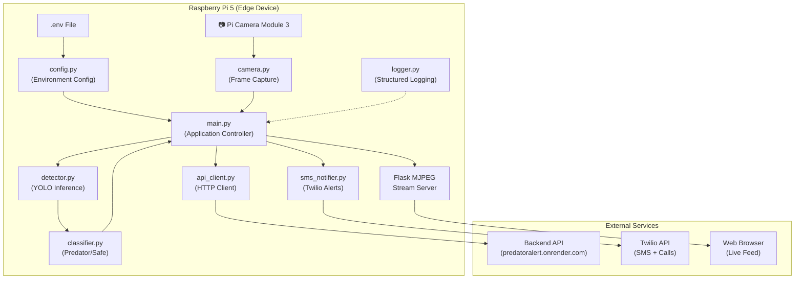
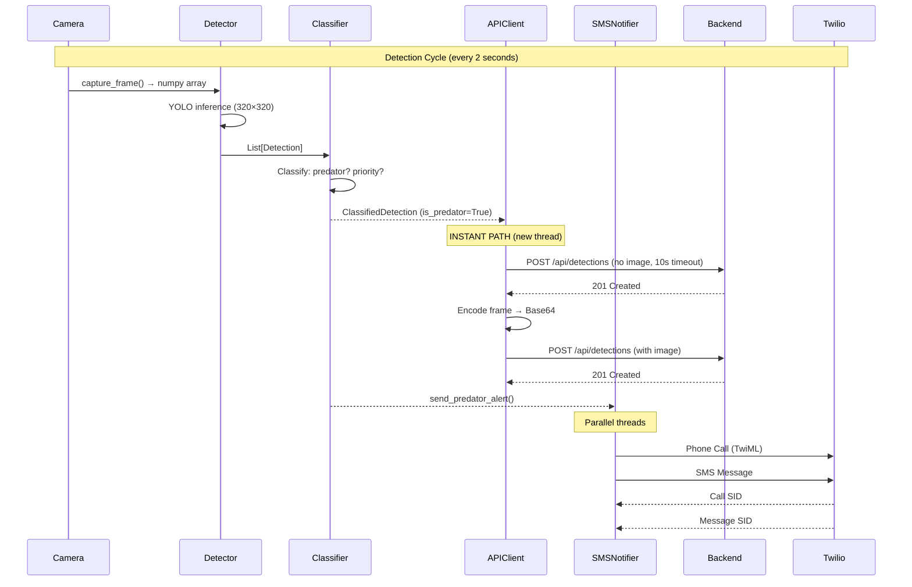
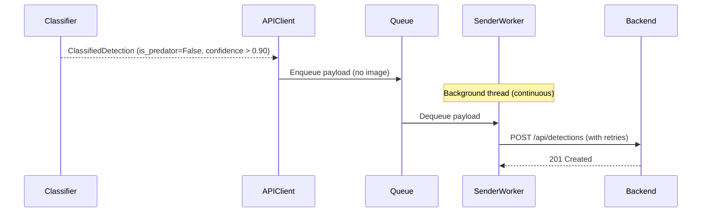

# PredatorAlert — Technical Documentation

> **Version**: 1.0  
> **Platform**: Raspberry Pi 5 (ARM64)  
> **Language**: Python 3.12  
> **Last Updated**: March 2026

---

## Table of Contents

1. [Project Overview](#1-project-overview)
2. [System Architecture](#2-system-architecture)
3. [Directory Structure](#3-directory-structure)
4. [Configuration](#4-configuration)
5. [Core Modules — Detailed Reference](#5-core-modules--detailed-reference)
   - 5.1 [config.py — Configuration Manager](#51-configpy--configuration-manager)
   - 5.2 [logger.py — Structured Logging](#52-loggerpy--structured-logging)
   - 5.3 [camera.py — Frame Capture Engine](#53-camerapy--frame-capture-engine)
   - 5.4 [detector.py — YOLO Wildlife Detector](#54-detectorpy--yolo-wildlife-detector)
   - 5.5 [classifier.py — Animal Classification](#55-classifierpy--animal-classification)
   - 5.6 [api_client.py — Backend Communication](#56-api_clientpy--backend-communication)
   - 5.7 [sms_notifier.py — SMS & Phone Call Alerts](#57-sms_notifierpy--sms--phone-call-alerts)
   - 5.8 [main.py — Application Controller](#58-mainpy--application-controller)
6. [Utility Scripts](#6-utility-scripts)
7. [Deployment & Operations](#7-deployment--operations)
8. [Data Flow & Sequence Diagrams](#8-data-flow--sequence-diagrams)
9. [API Specification](#9-api-specification)
10. [Performance Optimizations](#10-performance-optimizations)
11. [Troubleshooting Guide](#11-troubleshooting-guide)

---

## 1. Project Overview

**PredatorAlert** is a real-time wildlife detection and alert system designed to run on a Raspberry Pi 5 edge device. It uses a custom-trained YOLO (You Only Look Once) computer vision model to detect and classify wild animals through a connected camera, and immediately alerts stakeholders when a predator is detected.

### Key Capabilities

| Capability | Description |
|---|---|
| **Real-Time Detection** | Continuous camera feed processed by a YOLO model at configurable intervals |
| **Animal Classification** | Detected animals are classified as predator or safe, with priority levels |
| **Instant Alerts** | Predator detections trigger immediate API calls, SMS messages, and phone calls |
| **Live Video Stream** | MJPEG web stream accessible via browser at `http://<pi-ip>:5000` |
| **Edge Processing** | All inference runs locally on the Pi — no cloud AI dependency |
| **Auto-Recovery** | Systemd service with auto-restart, memory/CPU limits, and graceful shutdown |

### Target Animals (Custom 5-Class Model)

| Class | Priority | Threat Level |
|---|---|---|
| Tiger | 1 — Critical | Direct threat to human life |
| Elephant | 2 — High | Dangerous large animal |
| Wild Boar | 2 — High | Dangerous large animal |
| Monkey | 3 — Medium | Nuisance / property threat |
| Fox | 3 — Medium | Nuisance / property threat |

---

## 2. System Architecture



### Execution Flow Summary

1. **Startup** — `main.py` loads configuration, initializes all modules, starts the Flask web server and display loop in background threads.
2. **Detection Loop** (main thread) — Every `DETECTION_INTERVAL_SECONDS` (default 2s):
   - Captures a frame from the camera
   - Runs YOLO inference via `detector.py`
   - Classifies results via `classifier.py`
   - Sends alerts via `api_client.py` and `sms_notifier.py`
3. **Display Loop** (background thread) — At `STREAM_FPS` (default 10 FPS):
   - Reads the latest frame from the camera
   - Overlays detection bounding boxes
   - Updates the global frame buffer for the web stream
4. **Web Stream** (background thread) — Flask serves MJPEG frames to any connected browser.

---

## 3. Directory Structure

```
raspberry_pi5/
├── models/                      # YOLO model weights
│   ├── 5class.pt                # Custom-trained PyTorch model (primary)
│   ├── best.pt                  # Alternative PyTorch model
│   ├── best.onnx                # ONNX-optimized model (for ARM64)
│   └── my_model2.pt             # Additional model variant
│
├── logs/                        # Runtime log output directory
│
├── .env                         # Active environment configuration (SECRET — not committed)
├── .env.example                 # Template for environment variables
├── pyrightconfig.json           # Python type-checker configuration
├── requirements.txt             # Python package dependencies
│
├── config.py                    # Configuration manager (loads .env)
├── logger.py                    # Structured logging (file + console)
├── camera.py                    # Camera frame capture (Picamera2 / OpenCV)
├── detector.py                  # YOLO model loading and inference
├── classifier.py                # Animal classification and prioritization
├── api_client.py                # Backend API HTTP client
├── sms_notifier.py              # Twilio SMS and phone call alerts
├── main.py                      # Main application entry point
│
├── test_detection.py            # Test detection on a static image
├── verify_local_model.py        # Verify model loads and runs correctly
├── view_camera.py               # Live camera view with detection overlay
├── download_model.py            # Verify model file is in place
│
├── deploy_to_pi.bat             # Windows script to SCP files to the Pi
├── setup_model.bat              # Windows helper for model setup instructions
├── predatoralert.service        # Systemd service unit file for auto-start
│
├── api_specification.md         # API endpoint documentation
├── DEPLOYMENT_GUIDE_PI5.md      # Step-by-step deployment guide
└── README.md                    # Project overview
```

---

## 4. Configuration

### 4.1 Environment Variables (`.env`)

All runtime configuration is loaded from a `.env` file via the `python-dotenv` package. The `.env.example` file serves as a template.

| Variable | Default Value | Description |
|---|---|---|
| **Device** | | |
| `DEVICE_ID` | `pi5-edge-001` | Unique identifier for this edge device |
| `GUI_ENABLED` | `True` | Enable local OpenCV window (disable for headless) |
| `STREAM_PORT` | `5000` | Port for the Flask MJPEG web stream |
| `STREAM_FPS` | `10` | Frames per second for the web stream (lower = less CPU) |
| **Backend API** | | |
| `API_URL` | `http://localhost:8000` | Backend server base URL |
| `API_KEY` | *(empty)* | Bearer token for API authentication |
| `API_TIMEOUT` | `60` | Max HTTP request timeout in seconds (capped at 15s internally) |
| `API_RETRIES` | `3` | Number of retry attempts for failed requests |
| **Detection** | | |
| `CONFIDENCE_THRESHOLD` | `0.65` | Minimum confidence to report a detection |
| `SAFE_ANIMAL_THRESHOLD` | `0.90` | Minimum confidence to report a safe animal to backend |
| `DETECTION_INTERVAL_SECONDS` | `2` | Seconds between detection cycles (prevents overheating) |
| **YOLO Model** | | |
| `MODEL_PATH` | `models/5class.pt` | Path to the YOLO model weights file |
| `INFERENCE_IMGSZ` | `320` | Input image size for inference (320 = fast, 640 = accurate) |
| **Camera** | | |
| `CAMERA_WIDTH` | `640` | Capture resolution width |
| `CAMERA_HEIGHT` | `480` | Capture resolution height |
| `CAMERA_FPS` | `30` | Camera capture FPS |
| `CAMERA_BUFFER_SIZE` | `1` | Camera buffer size (1 = always latest frame) |
| `CAMERA_RETRY_DELAY` | `5` | Seconds to wait before retrying camera connection |
| `CAMERA_THREADED` | `True` | Use background thread for camera capture |
| **Logging** | | |
| `LOG_FILE` | `/home/pi/logs/detections.log` | Path to the log file |
| `LOG_LEVEL` | `INFO` | Logging level (`DEBUG`, `INFO`, `WARNING`, `ERROR`) |
| **Image** | | |
| `JPEG_QUALITY` | `50` | JPEG compression quality for API image uploads |
| **Twilio SMS** | | |
| `SMS_ENABLED` | `True` | Enable or disable SMS/call notifications |
| `TWILIO_ACCOUNT_SID` | *(empty)* | Twilio Account SID |
| `TWILIO_AUTH_TOKEN` | *(empty)* | Twilio Auth Token |
| `TWILIO_NUMBER` | *(empty)* | Twilio sender phone number |
| `SMS_DESTINATION_NUMBER` | *(empty)* | Recipient phone number |
| `SMS_COOLDOWN_SECONDS` | `60` | Minimum seconds between alerts for the same animal |
| `CALL_ENABLED` | `True` | Enable phone call alerts in addition to SMS |

### 4.2 Animal Classification Mappings

Defined as module-level constants in `config.py`:

- **`PREDATOR_ANIMALS`** — Set of animal names classified as predators: `tiger`, `elephant`, `fox`, `monkey`, `wild_boar`
- **`SAFE_ANIMALS`** — Set of known safe animals: `cow`, `sheep`, `goat`, `horse`, `pig`, `chicken`, `bird`, `zebra`, `giraffe`
- **`PREDATOR_PRIORITY`** — Dict mapping each predator to a numeric priority (1 = most critical)
- **`DEFAULT_PRIORITY`** — Fallback priority value: `4`

---

## 5. Core Modules — Detailed Reference

### 5.1 `config.py` — Configuration Manager

**Purpose**: Centralizes all application configuration by loading environment variables from a `.env` file with sensible defaults.

**How It Works**:
1. On module import, `load_dotenv()` reads the `.env` file into `os.environ`.
2. The `Config` class defines all settings as **class-level attributes** with type annotations.
3. Each attribute calls `os.getenv()` with a default value, applying type conversion (`int()`, `float()`, `bool`) as needed.
4. The `validate()` classmethod checks for required settings (currently only `API_KEY`) and returns a list of error messages.

**Key Design Decision**: Class-level attributes (not instance attributes) mean configuration is evaluated once at import time and shared globally. There is no need to instantiate `Config()` — attributes are accessed directly as `Config.API_URL`.

```python
# Usage example
from config import Config
print(Config.API_URL)        # "http://localhost:8000"
print(Config.DEVICE_ID)      # "pi5-edge-001"
```

---

### 5.2 `logger.py` — Structured Logging

**Purpose**: Provides structured, dual-output logging (file + console) for all detection events and system status messages.

**Class: `DetectionLogger`**

| Method | Description |
|---|---|
| `__init__()` | Creates a Python logger named `predatoralert` and calls `_setup_logger()` |
| `_setup_logger()` | Creates the log directory, sets log level, adds file handler (JSON-compatible format) and console handler (journald-compatible format). Prevents duplicate handlers on re-initialization. |
| `log_detection(...)` | Logs a detection event with animal name, confidence, predator status, priority, and API status. Uses `WARNING` for predators, `INFO` for safe animals. |
| `log_startup()` | Logs `PredatorAlert starting` with the device ID |
| `log_shutdown()` | Logs graceful shutdown message |
| `log_error(message, exc)` | Logs an error, optionally including exception details |
| `log_camera_status(status)` | Logs camera connection state changes |
| `log_api_status(status, details)` | Logs API communication events |
| `log_heartbeat()` | Logs a periodic "system alive" message |

**Log Format (File)**:
```
2026-03-10T14:30:00+0530 | WARNING | PREDATOR_DETECTED | animal=tiger confidence=0.9200 predator=True priority=1 api_status=sent
```

**Log Format (Console)**:
```
WARNING: PREDATOR_DETECTED | animal=tiger confidence=0.9200 predator=True priority=1 api_status=sent
```

**Global Instance**: A singleton `detection_logger = DetectionLogger()` is created at module level and imported by all other modules.

---

### 5.3 `camera.py` — Frame Capture Engine

**Purpose**: Manages camera hardware connection and continuous frame capture, optimized for the Raspberry Pi 5 with a Pi Camera Module 3.

**Class: `Camera`**

**Connection Strategy** (in priority order):

| Strategy | Library | Description |
|---|---|---|
| 1. Picamera2 (Native) | `picamera2` | The native, high-performance library for Raspberry Pi cameras. Requests `BGR888` format to avoid color conversion overhead. |
| 2. OpenCV GStreamer (Fallback) | `cv2.VideoCapture` | Uses a GStreamer pipeline (`libcamerasrc`) as a fallback if Picamera2 is unavailable. |

**Double-Buffer Pattern**:

The camera uses a double-buffer system to avoid memory copies:

```
Background Thread:   capture → _back_frame → swap → _front_frame
Main Thread:         reads _front_frame (no copy, just reference)
```

- `_update()` runs in a daemon thread, continuously capturing frames and storing them in `_front_frame` under a thread lock.
- `capture_frame()` returns the `_front_frame` reference directly. Callers that need to modify the frame must copy it themselves.

**Key Methods**:

| Method | Description |
|---|---|
| `connect()` | Attempts Picamera2 first, then GStreamer fallback. Starts the background capture thread. Returns `True` on success. |
| `capture_frame()` | Returns the latest frame (no copy). Returns `None` if no frame is available. |
| `disconnect()` | Stops the background thread, releases camera hardware resources. |
| `is_connected()` | Returns `True` if the camera is actively running. |

**Context Manager Support**: The `Camera` class supports Python's `with` statement:
```python
with Camera() as cam:
    frame = cam.capture_frame()
```

---

### 5.4 `detector.py` — YOLO Wildlife Detector

**Purpose**: Loads a YOLO model and runs object detection inference on camera frames.

**Data Class: `Detection`**

Represents a single detected object:

| Field | Type | Description |
|---|---|---|
| `class_name` | `str` | Detected animal name (lowercase, underscored) |
| `confidence` | `float` | Detection confidence score (0.0–1.0) |
| `x`, `y` | `int` | Center coordinates of the bounding box |
| `width`, `height` | `int` | Dimensions of the bounding box |
| `bbox` | `property` | Returns `(x, y, width, height)` as a tuple |

**Class: `WildlifeDetector`**

| Method | Description |
|---|---|
| `__init__()` | Stores the model path and image size from `Config`. Model is not loaded yet. |
| `initialize()` | Loads the YOLO model from disk using `ultralytics.YOLO()`. Performs a warm-up inference with a dummy black frame to pre-compile internal computations. Returns `True` on success. |
| `detect(frame)` | Runs YOLO inference on the given NumPy frame. Filters detections by `CONFIDENCE_THRESHOLD`. Normalizes class names to lowercase with underscores. Returns a list of `Detection` objects. |
| `is_ready()` | Returns `True` if the model is loaded and initialized. |

**Inference Pipeline**:
1. Frame → `model(frame, conf=threshold, imgsz=320, verbose=False)`
2. Parse `results[0].boxes` for each detection
3. Extract class ID → map to class name via `model.names`
4. Normalize name: `"Wild Boar"` → `"wild_boar"`
5. Extract `xywh` bounding box coordinates
6. Construct and return `Detection` dataclass

---

### 5.5 `classifier.py` — Animal Classification

**Purpose**: Takes raw detections and classifies them as predator or safe, assigning priority levels for predators.

**Data Class: `ClassifiedDetection`**

| Field | Type | Description |
|---|---|---|
| `class_name` | `str` | Normalized animal name |
| `confidence` | `float` | Detection confidence |
| `is_predator` | `bool` | Whether this is a predator animal |
| `priority` | `int \| None` | Priority level (1–4) for predators, `None` for safe |
| `bbox` | `tuple` | Bounding box coordinates |
| `is_safe` | `property` | Inverse of `is_predator` |
| `priority_label` | `property` | Human-readable: `"critical"`, `"high"`, `"medium"`, `"low"` |

**Class: `AnimalClassifier`**

| Method | Description |
|---|---|
| `classify(detection)` | Takes a `Detection`, normalizes the class name, checks against `PREDATOR_ANIMALS`, assigns priority from `PREDATOR_PRIORITY`. Returns a `ClassifiedDetection`. |
| `classify_batch(detections)` | Classifies a list of detections. |
| `_normalize_class_name(name)` | Handles variations in class names (e.g., `"Bengal Tiger"` → `"tiger"`, `"African Elephant"` → `"elephant"`). Uses a mapping dictionary for common variations. |
| `get_predators_only(classified)` | Filters to return only predator detections. |
| `get_safe_only(classified)` | Filters to return only safe animal detections. |
| `sort_by_priority(classified)` | Sorts by priority (1 first), then by confidence (highest first). |

**Name Normalization Mappings**:

```
bengal_tiger, siberian_tiger  →  tiger
african_elephant, asian_elephant  →  elephant
grizzly_bear, brown_bear, black_bear, polar_bear  →  bear
gray_wolf, grey_wolf  →  wolf
red_fox, arctic_fox  →  fox
wild_pig  →  pig
wild-boar  →  wild_boar
```

---

### 5.6 `api_client.py` — Backend Communication

**Purpose**: Sends detection events to the backend API server with optimizations for instant predator alerts.

**Data Class: `DetectionPayload`**

| Field | Type | Description |
|---|---|---|
| `device_id` | `str` | Edge device identifier |
| `animal` | `str` | Detected animal name |
| `confidence` | `float` | Detection confidence |
| `timestamp` | `str` | ISO 8601 UTC timestamp |
| `image_base64` | `str` | Base64-encoded JPEG image (optional) |

**Class: `APIClient`**

The API client uses a **dual-path architecture** for different alert urgencies:

```
┌──────────────────────────────────────────────────────┐
│                    send_detection()                    │
│                                                        │
│  is_predator=True?              is_predator=False?     │
│       │                                │               │
│       ▼                                ▼               │
│  INSTANT PATH                    QUEUE PATH            │
│  (new thread)                  (_outgoing_queue)       │
│       │                                │               │
│  ┌────┴────┐                    _sender_worker()       │
│  │ Step 1  │                    (background thread)    │
│  │ Fast    │                           │               │
│  │ Alert   │                           ▼               │
│  │ (no img)│                   _send_actual_request()  │
│  └────┬────┘                   (with retries)          │
│       │                                                │
│  ┌────┴────┐                                           │
│  │ Step 2  │                                           │
│  │ Image   │                                           │
│  │ Follow  │                                           │
│  └─────────┘                                           │
└──────────────────────────────────────────────────────┘
```

**Key Methods**:

| Method | Description |
|---|---|
| `__init__()` | Initializes connection pool via `requests.Session` with `HTTPAdapter` (2 connections, 4 max pool size, no built-in retries). Caps timeout at 15 seconds. |
| `start()` | Starts the background sender worker thread and sends a wake-up ping to the server (critical for Render.com cold starts). |
| `stop()` | Stops the sender thread and closes the HTTP session. |
| `send_detection(...)` | **Predators**: Spawns a new thread that sends the alert immediately without image, then follows up with the image. **Safe animals**: Enqueues to the background worker. |
| `_send_predator_instant(...)` | Step 1: Sends a minimal JSON payload (no image) with a 10s timeout. Step 2: Encodes and sends the image separately. |
| `_send_with_fast_timeout(payload)` | Single-attempt POST with 10s timeout. No retries — speed is the priority. |
| `_send_actual_request(payload)` | POST with configurable retries and short backoff (1s, 2s). Used for image payloads and safe animal detections. |
| `_encode_frame(frame)` | Encodes a NumPy frame as JPEG with configurable quality, then Base64-encodes it for JSON transport. |
| `_sender_worker()` | Background loop that dequeues payloads and sends them with retries. Drops payloads after max retries. |

**Connection Optimization**:
- `requests.Session` reuses TCP connections (HTTP keep-alive)
- Connection pool pre-warmed with 2 persistent connections
- Server wake-up ping on startup for cloud cold-start platforms (e.g., Render)

---

### 5.7 `sms_notifier.py` — SMS & Phone Call Alerts

**Purpose**: Sends instant phone call alerts and SMS messages via the Twilio API when predators are detected.

**Class: `SMSNotifier`**

| Method | Description |
|---|---|
| `initialize()` | Validates Twilio credentials and creates the Twilio client. Returns `True` if successful or if notifications are disabled. |
| `send_predator_alert(...)` | Checks cooldown, then fires both a phone call and SMS in parallel background threads. Returns `False` if in cooldown or not initialized. |
| `_send_call(...)` | Creates a Twilio voice call with TwiML that speaks the alert message (animal name, confidence, priority level, device ID) using the `alice` voice in `en-IN` locale. |
| `_send_sms(...)` | Sends an SMS with formatted alert details (emoji header, animal, confidence, priority, device ID). |
| `is_ready()` | Returns `True` if initialized or if notifications are disabled. |

**Cooldown System**:
- Tracked per animal class via `_last_alert_time` dictionary
- Default cooldown: 60 seconds (configurable via `SMS_COOLDOWN_SECONDS`)
- Prevents alert spam when the same animal is continuously detected
- Thread-safe via `threading.Lock`

**Phone Call TwiML Example**:
```xml
<Response>
  <Say voice="alice" language="en-IN">
    Warning! Predator Alert! A tiger has been detected with 92% confidence.
    Priority level: critical. Please check the camera feed immediately.
    Repeating: A tiger has been detected near your area.
  </Say>
  <Pause length="1"/>
  <Say voice="alice" language="en-IN">
    This is an automated alert from Predator Alert device pi5-edge-001.
  </Say>
</Response>
```

---

### 5.8 `main.py` — Application Controller

**Purpose**: Orchestrates all components — camera, detector, classifier, API client, SMS notifier, and web stream — into a single coordinated application.

**Class: `PredatorAlertApp`**

**Initialization Sequence** (`initialize()`):

```
1. Log startup
2. Validate Config (check API_KEY)
3. Camera.connect() — Picamera2 or GStreamer
4. WildlifeDetector.initialize() — Load YOLO model + warm-up
5. AnimalClassifier() — Instantiate classifier
6. APIClient.start() — Start sender thread + wake server
7. SMSNotifier.initialize() — Connect to Twilio (non-fatal if fails)
```

**Runtime Threads**:

| Thread | Function | Rate | Description |
|---|---|---|---|
| Main Thread | `_detection_cycle()` | Every 2s | Captures frame → runs YOLO → classifies → sends alerts |
| Display Thread | `_display_loop()` | 10 FPS | Reads frames → draws overlays → updates stream buffer |
| Web Server Thread | `app.run()` | On-demand | Flask serves MJPEG frames to browsers |
| Sender Worker | `_sender_worker()` | Continuous | Dequeues and sends non-urgent detections |
| *(Per-alert)* | `_send_predator_instant()` | On detection | One-shot thread for each predator alert |

**Detection Cycle** (`_detection_cycle()`):

```python
frame = camera.capture_frame()          # 1. Get latest frame (no copy)
detections = detector.detect(frame)      # 2. YOLO inference
classified = classifier.classify_batch() # 3. Classify as predator/safe
self._latest_detections = classified     # 4. Share with display thread
for detection in classified:
    self._process_detection(detection)   # 5. Send API + SMS alerts
```

**Display & Streaming** (`_update_gui()`):

- Only copies the frame if there are detections to overlay (saves CPU when idle).
- Draws colored bounding boxes: **red** for predators, **green** for safe animals.
- Updates the global `output_frame` variable under a thread lock.
- Flask's `generate_frames()` reads `output_frame` and yields MJPEG chunks.
- Optionally shows a local OpenCV window if `GUI_ENABLED` is `True`.

**Shutdown Handling**:

- Registers `SIGINT` and `SIGTERM` handlers for graceful shutdown.
- Logs pending queue size before stopping the API client.
- Disconnects camera and releases all resources.

**Flask Web Server Endpoints**:

| Route | Response | Description |
|---|---|---|
| `GET /` | HTML | Simple page with an embedded `` tag pointing to `/video_feed` |
| `GET /video_feed` | MJPEG Stream | Continuous multipart JPEG stream for live video |

---

## 6. Utility Scripts

### 6.1 `test_detection.py`

**Purpose**: Test the YOLO model on a single static image (without a camera).

**Usage**:
```bash
python test_detection.py [image_path]
```

**Behavior**:
- If a path is provided as a CLI argument, uses that image.
- If no argument, prompts the user to enter a path.
- If the user presses Enter without input, auto-detects the most recently modified image file in the current directory.
- Falls back to `test_bear.jpg` if no images are found.
- Initializes the `WildlifeDetector`, loads the image with OpenCV, runs inference, and prints all detections with class name, confidence, and bounding box.

---

### 6.2 `verify_local_model.py`

**Purpose**: Verify that the YOLO model can be loaded and run inference without errors.

**Usage**:
```bash
python verify_local_model.py
```

**Behavior**:
1. Checks that the model file exists at `Config.MODEL_PATH`.
2. Initializes the `WildlifeDetector` (loads the model).
3. Runs inference on a 640×640 black dummy image.
4. Reports inference time and detection count.
5. Prints `[SUCCESS]` or `[ERROR]` status.

---

### 6.3 `view_camera.py`

**Purpose**: Live camera preview with real-time detection overlay (for development and testing).

**Usage**:
```bash
python view_camera.py
```

**Behavior**:
- Initializes the `Camera` and `WildlifeDetector`.
- Continuously captures frames, runs detection, and draws green bounding boxes with labels.
- Displays the result in an OpenCV window.
- Press `q` to quit. Also handles `Ctrl+C`.

---

### 6.4 `download_model.py`

**Purpose**: Verify that the custom 5-class model file is in the correct location.

**Usage**:
```bash
python download_model.py
```

**Behavior**:
- Checks for `models/5class.pt`.
- If found, prints the file size and confirmed classes.
- If not found, instructs the user to place the file manually.

---

## 7. Deployment & Operations

### 7.1 Dependencies

**`requirements.txt`**:
```
ultralytics        # YOLO model framework
opencv-python      # Computer vision (image processing, encoding)
numpy              # Numerical arrays (frame data)
requests           # HTTP client for backend API
python-dotenv      # Load .env configuration
flask              # MJPEG web stream server
twilio             # SMS and phone call alerts
```

On Raspberry Pi, you may also need:
```bash
pip3 install picamera2    # Native Pi camera library (usually pre-installed)
```

### 7.2 Deployment Script (`deploy_to_pi.bat`)

A Windows batch script that deploys the project to the Raspberry Pi via SCP:

1. Connects to the Pi at IP `192.168.31.77` as user `predator_alert_system`.
2. Deletes the existing `/home/predator_alert_system/predator_alert` directory.
3. Copies the entire project via `scp -r`.
4. Prints next steps (install requirements, run the app).

### 7.3 Systemd Service (`predatoralert.service`)

Runs PredatorAlert as a background system service that starts on boot:

```ini
[Service]
Type=simple
User=pi
WorkingDirectory=/home/pi/predatoralert
ExecStart=/home/pi/predatoralert/venv/bin/python main.py
Restart=on-failure
RestartSec=10

# Security
NoNewPrivileges=true
PrivateTmp=true

# Resource Limits
MemoryMax=2G
CPUQuota=80%
```

**Installation**:
```bash
sudo cp predatoralert.service /etc/systemd/system/
sudo systemctl daemon-reload
sudo systemctl enable predatoralert
sudo systemctl start predatoralert
```

**Management Commands**:
```bash
sudo systemctl status predatoralert   # Check status
sudo journalctl -u predatoralert -f   # View live logs
sudo systemctl restart predatoralert  # Restart
sudo systemctl stop predatoralert     # Stop
```

---

## 8. Data Flow & Sequence Diagrams

### 8.1 Predator Detection Flow



### 8.2 Safe Animal Detection Flow



---

## 9. API Specification

### Endpoint

| Property | Value |
|---|---|
| **URL** | `https://predatoralert.onrender.com/api/detections` |
| **Method** | `POST` |
| **Content-Type** | `application/json` |
| **Authorization** | `Bearer <API_KEY>` |

### Request Payload

```json
{
  "device_id": "pi5-edge-001",
  "animal": "tiger",
  "confidence": 0.92,
  "timestamp": "2026-03-10T14:30:00+00:00",
  "image_base64": "/9j/4AAQSkZJRg..."
}
```

| Field | Type | Required | Description |
|---|---|---|---|
| `device_id` | String | Yes | Unique device identifier |
| `animal` | String | Yes | Detected animal class name |
| `confidence` | Float | Yes | Detection confidence (0.0–1.0) |
| `timestamp` | String | Yes | ISO 8601 UTC timestamp |
| `image_base64` | String | No | Base64-encoded JPEG image (omitted in fast alerts) |

### Expected Responses

| Status Code | Meaning |
|---|---|
| `200`, `201`, `202` | Success — detection accepted |
| `401` | Unauthorized — invalid API key |
| `500` | Server error |

---

## 10. Performance Optimizations

The codebase contains several optimizations specifically for the Raspberry Pi 5's limited resources:

### CPU Optimizations

| Optimization | Location | Impact |
|---|---|---|
| **320px inference** | `detector.py` | 4× fewer pixels vs 640px = faster inference |
| **2s detection interval** | `main.py` | Prevents continuous CPU-intensive inference |
| **10 FPS stream** | `main.py` | Reduces JPEG encoding overhead vs 30 FPS |
| **Sleep-based throttling** | `main.py` | Sleeps instead of busy-polling between detections |
| **80% CPU quota** | `predatoralert.service` | Leaves 20% CPU for OS tasks |

### Memory Optimizations

| Optimization | Location | Impact |
|---|---|---|
| **Double-buffer pattern** | `camera.py` | Avoids allocating new frame on every capture |
| **No-copy frame reads** | `camera.py` | `capture_frame()` returns reference, not copy |
| **Conditional overlay copy** | `main.py` | Only copies frame when drawing bounding boxes |
| **2GB memory cap** | `predatoralert.service` | Prevents OOM crashes |
| **50% JPEG quality** | `api_client.py` | Smaller payloads = less memory for encoding |

### Network Optimizations

| Optimization | Location | Impact |
|---|---|---|
| **Connection pooling** | `api_client.py` | Reuses TCP connections via `requests.Session` |
| **Image-free fast alerts** | `api_client.py` | Minimal payload for instant predator alerts |
| **Server wake-up ping** | `api_client.py` | Pre-warms cloud server on startup |
| **15s timeout cap** | `api_client.py` | Prevents threads from blocking on slow servers |
| **Non-exponential backoff** | `api_client.py` | 1s, 2s retries instead of exponential waits |

### Thermal Management

| Optimization | Location | Impact |
|---|---|---|
| **BGR888 native format** | `camera.py` | Eliminates color conversion overhead |
| **Threaded capture** | `camera.py` | Background thread avoids blocking main loop |
| **Detection throttling** | `main.py` | 2s intervals prevent sustained high CPU load |
| **Stream throttling** | `main.py` | 10 FPS limits encoding workload |

---

## 11. Troubleshooting Guide

### Common Issues

| Symptom | Cause | Solution |
|---|---|---|
| `Failed to initialize camera` | Picamera2 not installed or camera not connected | Install `picamera2`, check ribbon cable connection, run `libcamera-hello` to test |
| `Failed to load YOLO model` | Model file missing or corrupted | Run `python download_model.py` to verify. Check `MODEL_PATH` in `.env` |
| `Request timeout` | Backend server unreachable | Check `API_URL` in `.env`. If using Render, the server may be cold-starting |
| `SMS/Call failed` | Twilio credentials invalid or missing | Verify `TWILIO_ACCOUNT_SID`, `TWILIO_AUTH_TOKEN`, `TWILIO_NUMBER` in `.env` |
| `No animals detected` | Low confidence or wrong model | Lower `CONFIDENCE_THRESHOLD` in `.env`. Verify model has the correct classes |
| `High CPU / overheating` | Detection running too fast | Increase `DETECTION_INTERVAL_SECONDS`, decrease `STREAM_FPS` |
| `API_KEY is required` error | Missing API key at startup | Set `API_KEY` in your `.env` file |
| `localhost` API errors on Pi | Pi is trying to call itself | Change `API_URL` to the actual backend URL (not `localhost`) |

### Log File Location

```
/home/pi/logs/detections.log
```

### Useful Commands

```bash
# View live application logs (systemd)
sudo journalctl -u predatoralert -f

# Test camera connection
libcamera-hello

# Test model independently
python test_detection.py test_bear.jpg

# Verify model loads correctly
python verify_local_model.py

# Live camera preview with detections
python view_camera.py

# Check system temperature
vcgencmd measure_temp
```

---

> **Document prepared for the PredatorAlert Project — Raspberry Pi 5 Edge Device**  
> *For questions or updates, refer to the project repository and deployment guide.*
